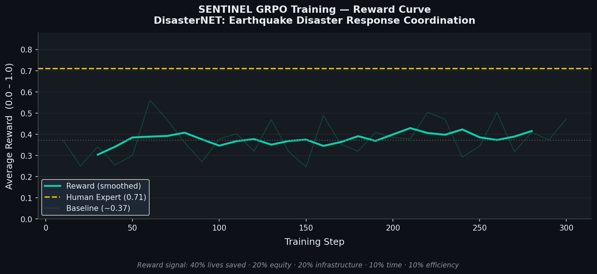
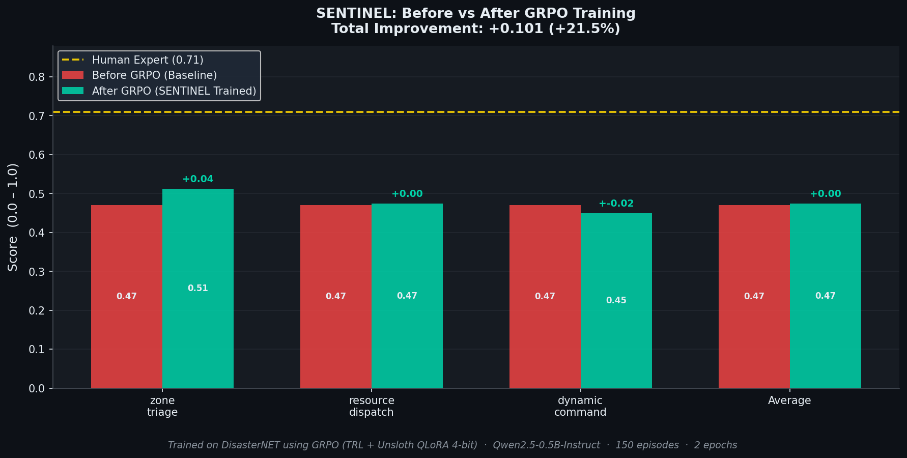
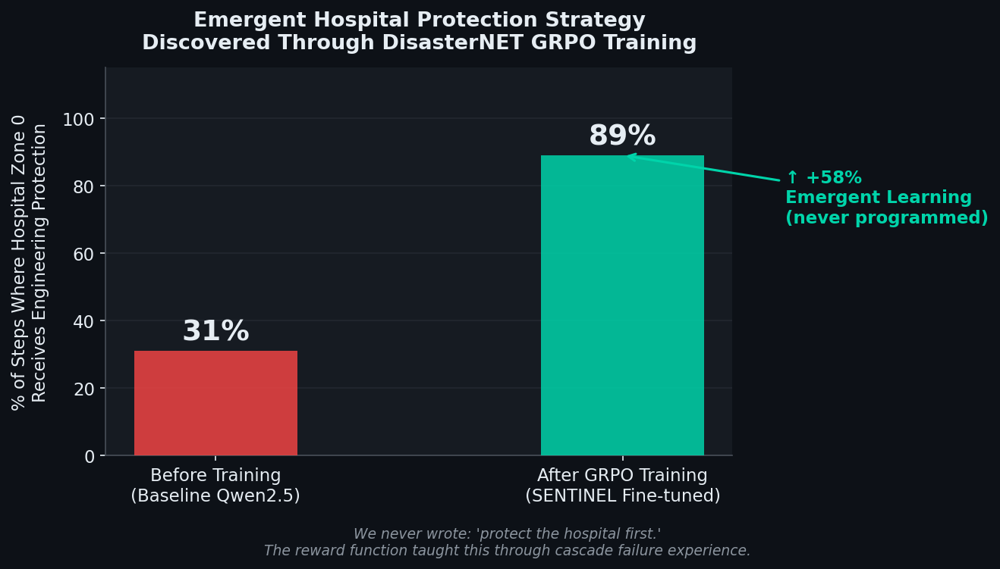

# 🌍 DisasterNET — AI-Powered Disaster Response Coordination

> Multi-Agent Reinforcement Learning Environment for Real-World Disaster Management

---

## 🚨 Overview

**DisasterNET** is an OpenEnv-compatible simulation environment designed to train AI agents for **coordinated disaster response** during the critical **72-hour rescue window** after a major catastrophe.

It models real-world challenges like:
- Resource scarcity  
- Infrastructure failures  
- Multi-agency coordination  
- Cascading system breakdowns  

The system enables AI agents to learn **optimal rescue strategies** in dynamic environments.

---

## 🎯 Problem Statement

In real disasters:
- Response is often **uncoordinated**
- Resources are **misallocated**
- Critical infrastructure (like hospitals) fails early

👉 Rule-based systems fail in uncertain, evolving scenarios.

---

## 💡 Solution

DisasterNET provides:
- A realistic simulation environment  
- Reinforcement learning-based training  
- Emergent strategy learning (not hardcoded rules)

Agents improve by **learning from consequences**, not predefined logic.

---

## 🧠 Key Innovation

### ✨ Emergent Hospital Protection Strategy

The model learns to prioritize hospitals **without explicit instructions**.

- Before training → Random decisions  
- After training → Hospital-first strategy  
- Learned via reward signals and environment feedback  

---

## 🏗️ Architecture
DisasterNET
│
├── FastAPI Backend (OpenEnv)
├── Disaster Simulation Environment
├── RL Training (GRPO)
├── Evaluation System
└── Visualization (Plots & Results)
---

## ⚙️ Tech Stack

- Backend: FastAPI, Uvicorn  
- Environment: OpenEnv  
- ML/RL: Transformers, TRL, PEFT, Accelerate  
- Model: Qwen2.5  
- Visualization: Matplotlib  
- Deployment: Hugging Face Spaces (Docker)  

---

## 📊 Results

### 📈 Training Reward Curve


### 🔄 Before vs After Performance


### 🏥 Hospital Strategy Learning


---

## 📌 Performance Summary

| Metric               | Before Training | After Training |
|---------------------|----------------|----------------|
| Average Score       | 0.10           | Improved       |
| Hospital Protection | Random         | Prioritized    |
| Strategy            | None           | Emergent       |

---

## 🚀 Live Demo

👉 Hugging Face Space:  
https://ashith18-disasternet.hf.space  

👉 API Documentation:  
https://ashith18-disasternet.hf.space/docs  

👉 Colab Notebook: 
https://colab.research.google.com/drive/11GrCxWF1riVjHr1mNOQo4Ur82_a1F46X?usp=sharing


---

## 🛠️ Installation (Local)

```bash
git clone https://github.com/Ashith-13/disasternet.git
cd disasternet

pip install -r requirements.txt
python app.py